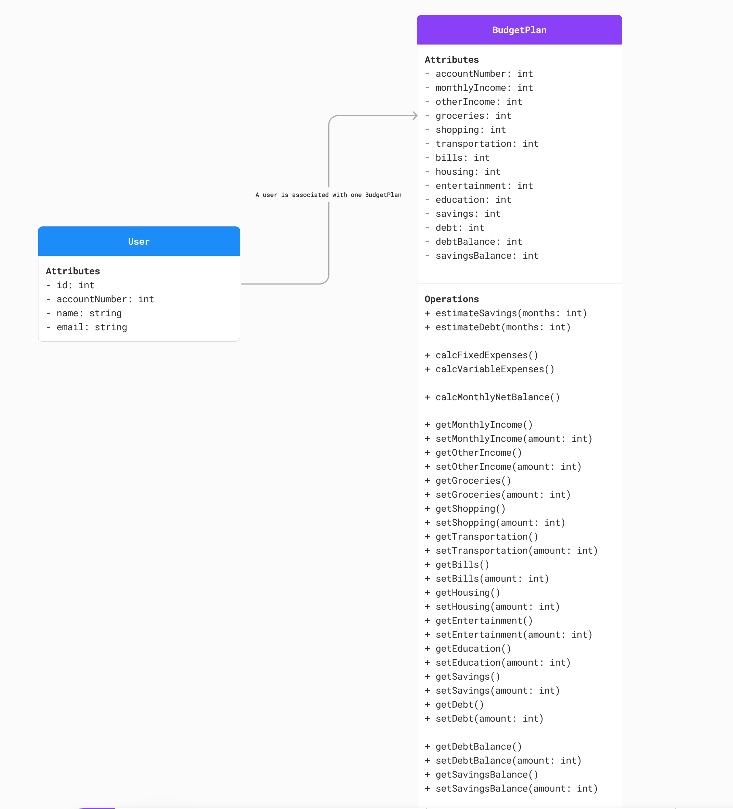
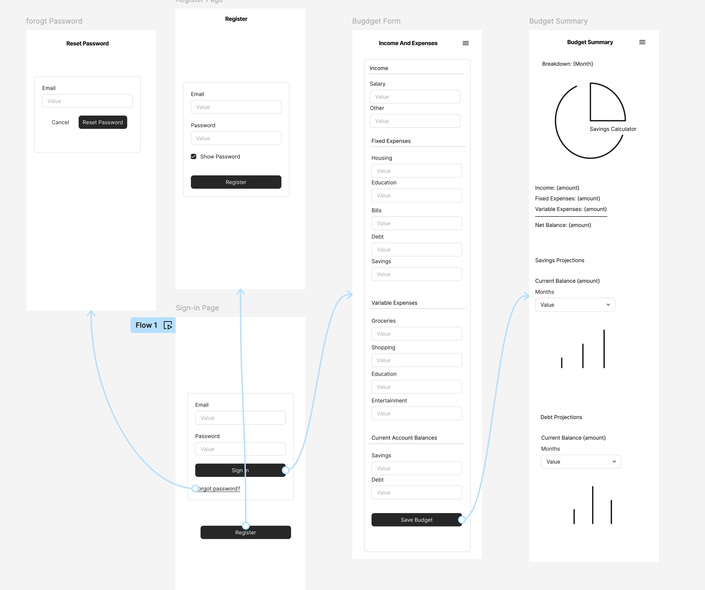
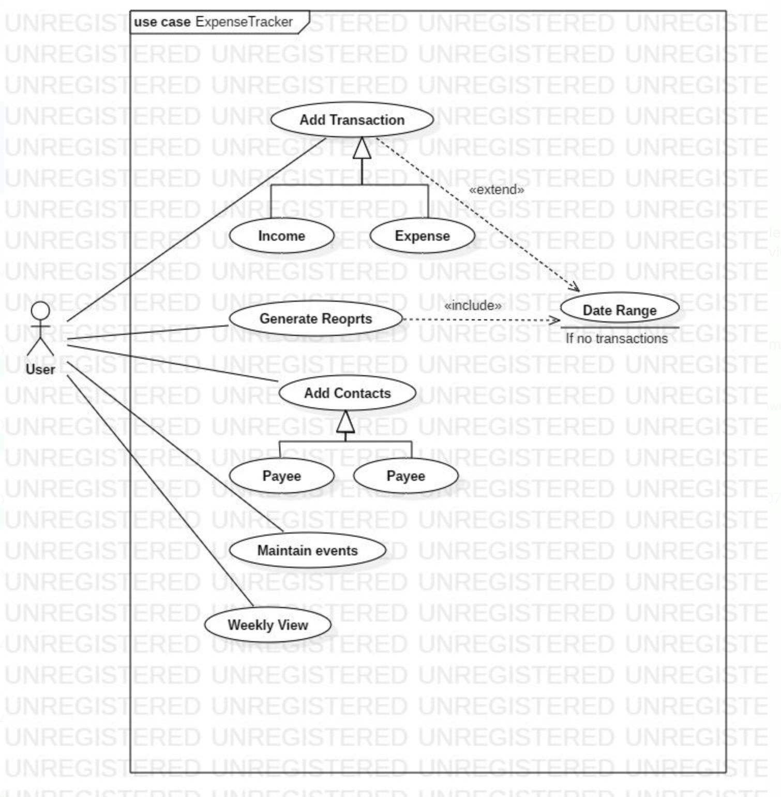

# Personal Budget Management and Savings Forecasting System

## Project Overview

The Personal Budget Management and Savings Forecasting System is a comprehensive application designed to help users effectively manage their monthly budgets and set achievable savings goals. By leveraging user data on income and expenditures, the system provides detailed forecasts and analyses, assisting users in better financial planning.

## Core Features

- **Monthly Budget Projection:** Predicts monthly budgets based on user-provided income and expenses.
- **Frequency Customization:** Allows users to define the frequency of their income and expenses (weekly, monthly, etc.).
- **Data Storage:** Saves user data across sessions for continuous budget management.
- **Data Security:** Implements strong security protocols to safeguard user budget information.
- **Savings Goal Setting:** Enables users to establish savings targets for specific items.
- **Savings Goal Projection:** Estimates the time required to achieve savings goals based on disposable income allocation.

## Additional Features

- **User-Friendly Interface:** Designed for easy navigation and usability.
- **Cross-Device Compatibility:** Accessible on both desktop and mobile devices.
- **Comprehensive Reports:** Provides detailed reports and visual charts of spending habits and savings progress.

## Technical Details

- **Operating Systems:** Compatible with Windows, macOS, Linux, iOS, and Android.
- **Programming Languages:** Developed using Python with Flask for the backend, MongoDB for the database, and Dash/Plotly for data visualization.
- **Third-Party Libraries and Tools:**
  - Flask or FastAPI for backend API development.
  - MongoEngine for MongoDB management.
  - PyJWT for secure authentication.
  - Matplotlib for data visualization.
  - Redux Toolkit with a Python frontend framework like Dash for state management.


## Setup and Installation

1. **Clone the repository:**
   ```bash
   git clone https://github.com/austin-carnahan/software-engineering-24.git
   cd software-engineering-24

### Running the app locally

1) python -m venv venv
2) source venv/Scripts/activate  # On Windows
3) source venv/bin/activate      # On macOS/Linux
4) pip install -r requirements.txt
5) python run.py or flask run
6) a) Navigate to the templates/home.html File, Open your code editor and navigate to the templates/home.html file.
b) Use Live Server
Right-click on home.html and select the option to open with Live Server. This will start a local server and open your default browser to view the HTML file.


Needs more documentation!
1. Activate virtual environment, if using
2. Install needed dependencies from requirements.txt
3. From the root project directory, run:

`flask --app app run`

### Design Diagrams







Team Members
1) Raghunath Kunigiri: Raghunath.Kunigiri@slu.edu
2) Gowthamsai Mukthineni: Gowthamsai.mukthineni@slu.edu
3) Sai Goutham Chedhella: saigoutham.chedhella@slu.edu
4) Austin Carnahan: ac6404@gmail.com
5) Saaisathish Sankarabhattar Ayyappan: ssankarabhattara@slu.edu
